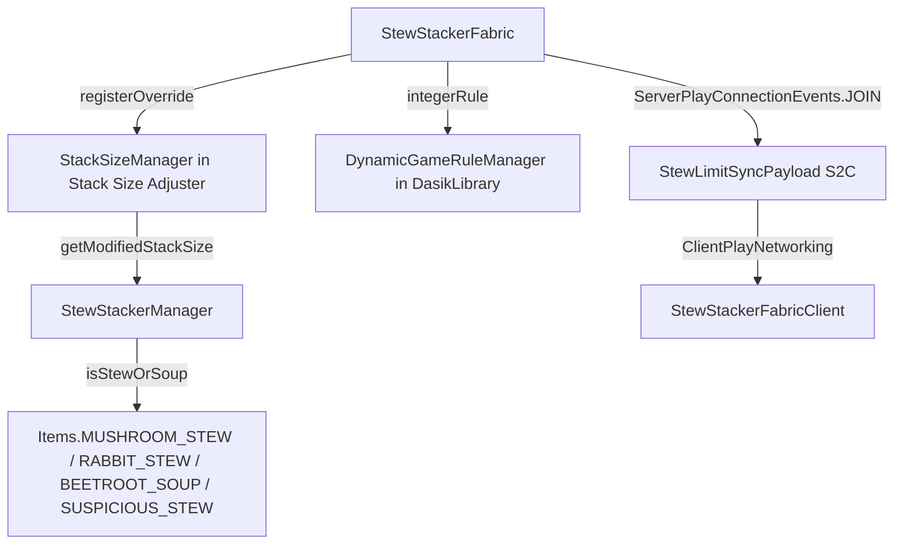

# Stew Stacker Addon Architecture

## 🏗️ Architectural Overview

## 🧩 Components

1. **`StewStackerFabric`**: Mod entrypoint registering `stew-stacker-addon:stew_limit` GameRule and registering stack size override callback into `StackSizeManager`.
2. **`StewStackerManager`**: Core logic checking item instances against stew/soup types and applying dynamic limits.
3. **`StewLimitSyncPayload`**: Custom packet payload for S2C limit synchronization.
4. **`StewStackerConfig`**: Baseline config template provider using DasikLibrary `ConfigHelper`.
5. **`YaclScreenHelper` & `ModMenuIntegration`**: Server-crash-safe optional YACL GUI configuration integration.
